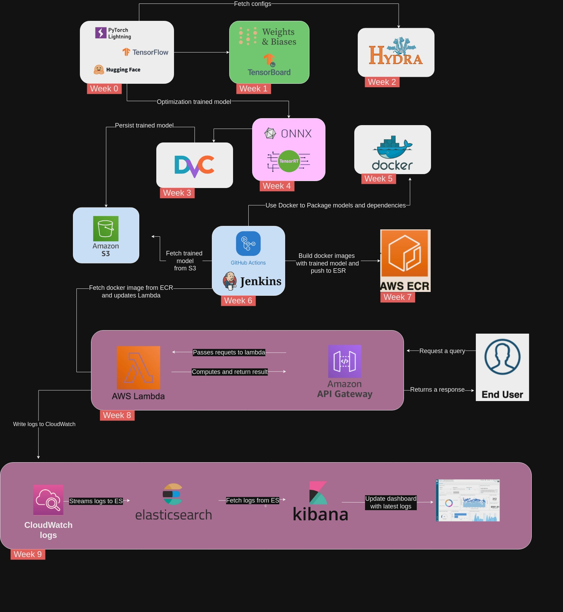
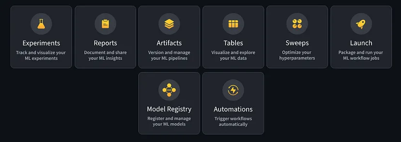

# MLOps Hands On Tutorial
MLOps, or Machine Learning Operations, is a set of practices and tools that aim to deploy and maintain machine learning models in production reliably and efficiently. It bridges the gap between data science and operations, enabling seamless integration of machine learning models into existing software systems. MLOps incorporates DevOps principles with machine learning workflows, ensuring continuous integration, continuous deployment (CI/CD), monitoring, and scalability of models.

This repository serves as a comprehensive guide to MLOps, covering the essential components such as model versioning, data management, automated pipelines, deployment strategies, and monitoring techniques. Whether you're a data scientist looking to operationalize your models or a developer wanting to integrate machine learning into your applications, this guide provides the tools and knowledge to implement effective MLOps practices.

**Note: Please raise an issue for any suggestions, corrections, and feedback.**

The goal of the series is to understand the basics of MLOps like model building, monitoring, configurations, testing, packaging, deployment, CICD, etc.

## Week 0: Project Setup

Refer to the [Blog Post here](https://medium.com/@mzeynali01/building-a-text-classification-model-with-pytorch-lightning-a-deep-dive-7a262cb5784b)

The project I have implemented is a simple classification problem. The scope of this week is to understand the following topics:

- `How to get the data?`
- `How to process the data?`
- `How to define dataloaders?`
- `How to declare the model?`
- `How to train the model?`
- `How to do the inference?`

Following tech stack is used:

- [Huggingface Datasets](https://github.com/huggingface/datasets)
- [Huggingface Transformers](https://github.com/huggingface/transformers)
- [Pytorch Lightning](https://pytorch-lightning.readthedocs.io/)

## Week 1: Model monitoring - Weights and Biases

Refer to the [Blog Post here](https://medium.com/@mzeynali01/enhancing-your-pytorch-lightning-workflow-with-weights-biases-0e78f58ab16b)

Tracking all the experiments like tweaking hyper-parameters, trying different models to test their performance and seeing the connection between model and the input data will help in developing a better model.

The scope of this week is to understand the following topics:

- `How to configure basic logging with W&B?`
- `How to compute metrics and log them in W&B?`
- `How to add plots in W&B?`
- `How to add data samples to W&B?`

Following tech stack is used:

- [Weights and Biases](https://wandb.ai/site)
- [torchmetrics](https://torchmetrics.readthedocs.io/)

References:

- [Tutorial on Pytorch Lightning + Weights & Bias](https://www.youtube.com/watch?v=hUXQm46TAKc)

- [WandB Documentation](https://docs.wandb.ai/)